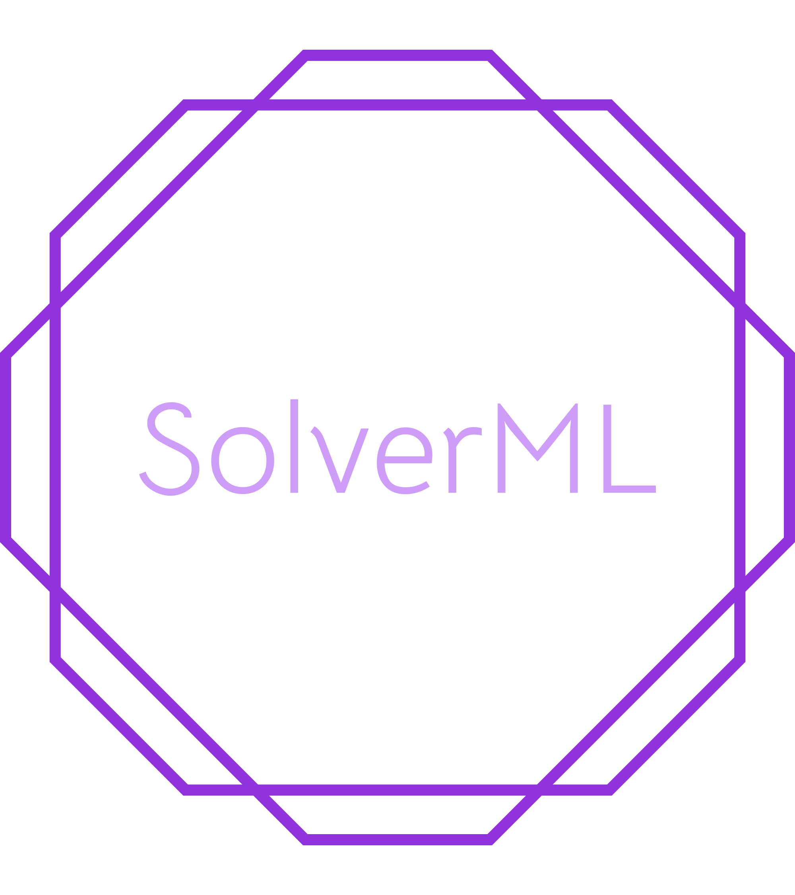

<h1 align = "center">SolverML</h1>

  

An easy to use app to build your own Machine Learning model.

Capabilities:
1. Data Wrangling
2. EDA Plotting
3. Feature Transformations and Engineering
4. Auto-Feature Selection
5. Unlimited ML modelling
6. Metrics Views
7. Hyperparameter Tuning
8. Model Interpretation
9. Prediction and Deployment Suite

